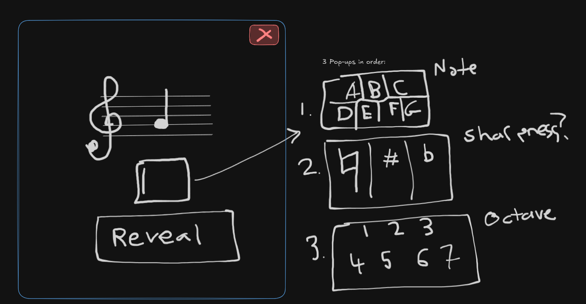

# Sheet Music Study

Document Version 0.1

#### Description
An Android app that helps you remember notes on the staff through flash-card training.

## Main Features (0.1)
- Upon launching the app, users will see a staff (treble cleff), and a note placed upon it. 
- (Moved to next version) There will be an entry field below the image for users to select the note (A-G), sharpness (Natural, Sharp, Flat), and Octave (1-7).
- Once the user has selected their notes, they may click a "reveal" button which reveals the correct answer.
- The "reveal" button will then turn into a "next" button, and the process will repeat again, infinitely.
- There is an exit button on the top right to close the app. 

### Layout
Here is a rough diagram of the initial layout of the app:

## Future Features
### Next Update (0.1.1?)
- An entry field below the staff for users to select the note (A-G), sharpness (Natural, Sharp, Flat), and Octave (1-7).

### Next Version (0.2)
- A main menu with help features explaining the features of the app.
- A basic sheet music primer to introduce new users to how sheet music works, with some pneumonics to help.

### Future Versions (0.3+)
- Sharp and flat symbols
- Support for scales (modifying the notes that appear)
- Options menu to be able to select which scales and symbols appear (and to turn note input off).
- Support for multiple notes at a time (chords) - Input can be through chord names, or listing the notes.
- Weighting which notes to display based on correctness and time taken to guess. 
  (Displaying notes more frequently, the longer someone takes to guess them)

### Further Future Versions
- Scale guessing support
- Support for multiple notes at a time (chords) - Input can be through chord names, or listing the notes.
- Microphone detection as substitute for note input. (needs an option to turn it on/off)
- Ad support?
- Google Play store release?

## Minimum Features to Release on Google Play Store
- Sharp and flat symbols.
- Main Menu, with options (customizing which octaves, sharps, and flats appear, help screen explaining sheet music fundamentals).
- Support for scales (both scale guessing and scale modifying notes) - Need a "mode" toggle between guessing notes and scales.
- Weighing which notes are shown more frequently.
- Microphone detection as substitute for note input.